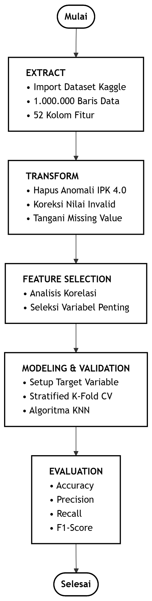
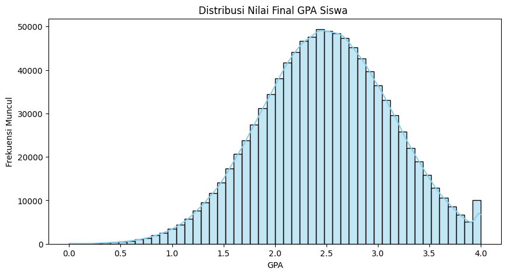
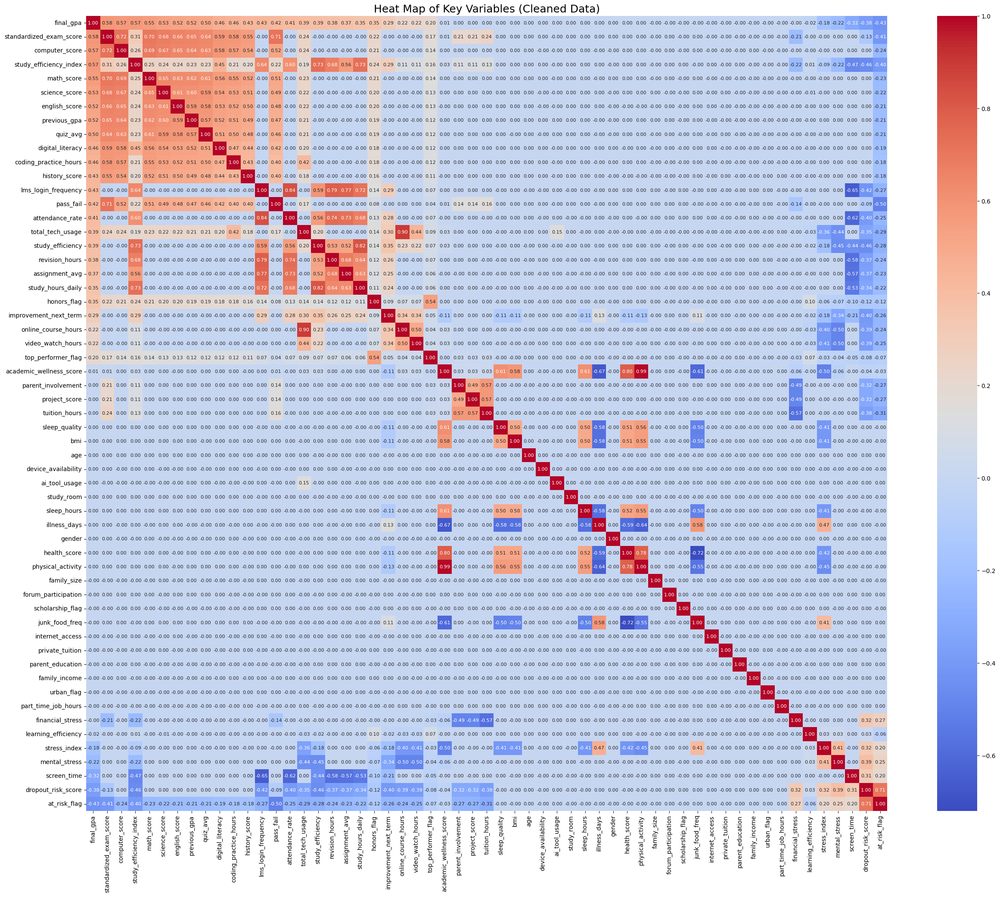
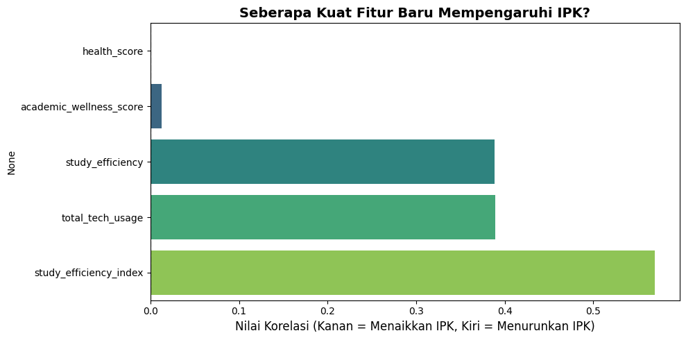

# Big Data Analytics Pada Kasus Data Student's Academic Performance menggunakan Algoritma K-Nearest Neighbor

**Kelompok 13** | **Kelas A S-1 Informatika**

## 👥 Anggota Kelompok

| Nama                      | NPM / NIM  |
| :------------------------ | :--------- |
| **Pandu Nugraha Saputra** | 2310511029 |
| **Bima Adnandita** | 2310511039 |
| **Rafli Wahyu Pratama** | 2310511031 |

---

## 📝 Latar Belakang

Proyek ini didasari oleh urgensi perlunya deteksi dini performa mahasiswa untuk mencegah kegagalan akademik (dropout). Terdapat keterbatasan pada studi terdahulu, seperti penggunaan dataset berskala kecil, pengabaian faktor eksternal (sosial-ekonomi & kebiasaan belajar), serta penanganan data tidak seimbang (imbalanced dataset) yang kurang optimal. Proyek ini mengatasi keterbatasan tersebut dengan mengimplementasikan algoritma Machine Learning **K-Nearest Neighbors (KNN)** pada 1 juta baris data _Student's Academic Performance_ dari Kaggle guna menghasilkan model prediksi yang komprehensif dan dapat digeneralisasi.

## 🎯 Tujuan Proyek

1. Mengidentifikasi dan memetakan faktor-faktor utama (aspek akademik, demografi, dan sosial-ekonomi) yang paling memengaruhi IPK mahasiswa dari dataset skala besar.
2. Membangun model Machine Learning berbasis algoritma KNN yang mampu memprediksi nilai IPK serta mengklasifikasikan status risiko dropout mahasiswa secara akurat.
3. Menyediakan benchmark sistem prediktif yang terukur untuk mendukung pengambilan keputusan berbasis data (data-driven) bagi pihak manajemen institusi pendidikan.

## ⚙️ Alur Pemrosesan Data (Data Pipeline)

1. **Ekstraksi Data (Extract):** Mengimpor 1.000.000 baris dan 52 kolom dataset dari Kaggle.
2. **Transformasi & Pembersihan (Transform):**
   - Mengeliminasi ~50.000 data anomali/invalid (contoh: menghapus 4.489 baris data dengan IPK 4.0 palsu yang terbukti cacat secara statistik).
   - Menangani missing value dan membuang data dengan nilai ujian/tugas tidak logis (skor > 100 atau < 0).
3. **Feature Selection & Engineering:** - Melakukan reduksi dimensi fitur via analisis korelasi.
   - Mentransformasi variabel mentah menjadi indikator baru seperti _Study Efficiency Index_, _Health & Wellness Score_, dan _Total Tech Usage_.
4. **Pemodelan & Validasi (Modeling):**
   - Menggunakan teknik **Stratified Sampling 10%** (100.000 baris) untuk mengatasi tantangan komputasi berlebih dari algoritma berbasis instance seperti KNN.
   - Melatih algoritma KNN yang divalidasi menggunakan Stratified K-Fold Cross Validation.

---

## 📊 Analisis & Visualisasi Data (EDA)

Dalam proses *Exploratory Data Analysis*, kami menemukan beberapa *insight* krusial yang mendasari proses *Data Cleaning* dan pembentukan fitur baru:

### 1. Identifikasi & Pembersihan Anomali Data (GPA 4.0 Palsu)
Pada distribusi mentah, kami menemukan anomali fatal pada nilai **Final GPA 4.0**. Terdapat ribuan baris data siswa dengan IPK sempurna namun tercatat memiliki 0 jam belajar dan presensi yang sangat rendah. Baris *error* sistem ini kami bersihkan secara statistik untuk mencegah model memelajari pola yang salah (bias).

*(Visualisasi: Perbandingan distribusi GPA sebelum pembersihan yang memiliki lonjakan anomali di angka 4.0, dan distribusi natural setelah dibersihkan)*

### 2. Peta Korelasi Variabel (Heatmap)
Analisis korelasi multivariat menunjukkan bagaimana faktor internal dan eksternal saling tumpang tindih dalam memengaruhi IPK.

*(Visualisasi: Matriks korelasi antar variabel akademik, gaya hidup, dan performa)*

**Temuan Utama dari Heatmap:**
- Variabel akademik seperti `standardized_exam_score` memiliki korelasi positif paling kuat terhadap `final_gpa`.
- Terdapat korelasi negatif yang jelas antara tingkat stres tinggi dengan penurunan performa, yang berujung pada peningkatan *flag* risiko *dropout*.

### 3. Dampak Feature Engineering (Efisiensi Belajar)
Kombinasi fitur mentah menjadi indikator baru membuka perspektif yang lebih akurat mengenai kebiasaan mahasiswa.

*(Visualisasi: Dampak Study Efficiency Index dan indikator gaya hidup terhadap IPK)*

**Temuan Utama Ekstraksi Fitur:**
- **Efisiensi Belajar:** Terdapat kenaikan IPK yang sangat stabil seiring meningkatnya efisiensi belajar (rasio antara waktu belajar yang digunakan dengan presensi dan pemahaman).
- **Penggunaan Teknologi:** Berbeda dengan asumsi umum, penggunaan teknologi intensif pada dataset ini justru berkorelasi dengan *penurunan* tingkat stres mental, kemungkinan berfungsi sebagai sarana relaksasi (hiburan/game).
- **Stres vs Jam Tidur:** Durasi tidur yang cukup berbanding lurus secara signifikan dengan penurunan indeks stres.

---

## 🚀 Evaluasi Performa Model ML

Setelah dilatih menggunakan data yang bersih, model KNN menunjukkan performa yang menjanjikan:

**1. KNN Regressor (Prediksi final_gpa)**
- **Rata-rata R² Score:** 0.6493
- **Rata-rata Mean Absolute Error (MAE):** 0.2944

**2. KNN Classifier (Deteksi at_risk_flag)**
- **Accuracy:** 0.78 (78%)
- **Precision (Macro Avg):** 0.78
- **Recall (Macro Avg):** 0.78
- **F1-Score (Macro Avg):** 0.78

---

## 💡 Insight & Tindak Lanjut Strategis

Dari hasil pemodelan dan analisis fitur, manajemen institusi pendidikan dapat memetakan mahasiswa ke dalam beberapa profil untuk melakukan intervensi berbasis data (*data-driven*):

🎓 **Profil 1: Top Performer (Efisiensi Tinggi)**
- **Karakteristik:** Memiliki *Study Efficiency Index* tinggi. Mereka membuktikan bahwa IPK unggul tidak dicapai dari sekadar durasi belajar yang ekstrem, melainkan keseimbangan antara fokus akademik dan jam tidur yang teratur (kesejahteraan mental terjaga).
- **Tindak Lanjut:** Jadikan kelompok ini sebagai agen pendampingan (*peer-mentor*) bagi mahasiswa di tingkat bawahnya, serta berikan apresiasi/beasiswa untuk menjaga retensi prestasi.

⚠️ **Profil 2: Berisiko Tinggi (Risiko Dropout)**
- **Karakteristik:** Terdeteksi memiliki indeks stres tinggi, jam tidur minim, dan efisiensi belajar rendah. Kondisi komulatif ini secara matematis menggerus IPK mereka hingga diklasifikasikan ke dalam `at_risk_flag`.
- **Tindak Lanjut (Sistem Peringatan Dini):** Ketika model memprediksi status risiko (*at risk*), kampus harus segera mengalokasikan bimbingan konseling akademik atau psikologis proaktif, serta lokakarya manajemen waktu, *sebelum* kegagalan akademik benar-benar terjadi.

**Kesimpulan Utama:**
Durasi jam belajar saja **tidak cukup** jika tidak diimbangi dengan kualitas kesejahteraan mahasiswa. Efisiensi belajar dan kesejahteraan akademik (tidur, stres, aktivitas) adalah pilar penentu IPK yang sebenarnya.

---

## 📺 Video Presentasi Proyek

Tonton penjelasan lengkap mengenai proses analisis, pembersihan data, dan visualisasi temuan kami pada video presentasi berikut:

_(Klik gambar di atas untuk memutar video)_